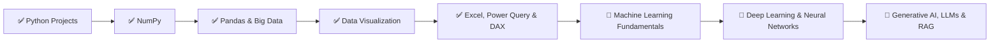

<p align="center">
  
</p>
 
<h1 align="center">📊 Data Science & Analytics with GenAI — Learning Journey</h1> 

<p align="center">
  <em>A comprehensive, production-grade repository documenting my complete learning path through the <strong>Data Science and Analytics with GenAI</strong> curriculum — spanning Python fundamentals, numerical computing, advanced data wrangling, statistical visualization, Excel Business Intelligence (Power Query, Power Pivot, DAX), and interactive full-stack data applications.</em>
</p>

<p align="center">   
  
  
  
  
  
  
  
  
  
  
</p>

<p align="center">
  
  
  
  
  
</p>

<p align="center">
  
  
  
</p>

---

## 📑 Table of Contents 

- [🧭 About](#-about)
- [🎯 Learning Objectives](#-learning-objectives)
- [📂 Folder Structure](#-folder-structure)
- [📘 Topics Covered](#-topics-covered)
  - [🔢 NumPy — Numerical Python](#-numpy--numerical-python)
  - [🐼 Pandas — Data Analysis & Manipulation](#-pandas--data-analysis--manipulation)
  - [📊 Matplotlib — Data Visualization](#-matplotlib--data-visualization)
  - [🎨 Seaborn — Statistical Visualization](#-seaborn--statistical-visualization)
  - [📈 Excel, Power Query, Power Pivot & DAX](#-excel-power-query-power-pivot--dax)
  - [🐍 Python Core & Engineering](#-python-core--engineering)
- [📁 Folder Descriptions](#-folder-descriptions)
- [🛠️ Technologies Used](#️-technologies-used)
- [📚 Libraries & Tools](#-libraries--tools)
- [📓 Notebooks & Workbooks Guide](#-notebooks--workbooks-guide)
- [🚀 Featured Projects & Case Studies](#-featured-projects--case-studies)
  - [🎮 Project 1: Tic Tac Toe — NumPy Edition](#-project-1-tic-tac-toe--numpy-edition)
  - [📚 Project 2: Library Management System](#-project-2-library-management-system)
  - [📈 Project 3: Student Performance Analysis (1M+ Records)](#-project-3-student-performance-analysis-1m-records)
  - [📁 Project 4: File & Exception Handling CRUD System](#-project-4-file--exception-handling-crud-system)
  - [📊 Project 5: Power Pivot & DAX Star Schema Sales Intelligence](#-project-5-power-pivot--dax-star-schema-sales-intelligence)
  - [📉 Project 6: Interactive Excel Analytics & Dynamic Dashboards](#-project-6-interactive-excel-analytics--dynamic-dashboards)
- [📅 Daily Progress Timeline](#-daily-progress-timeline)
- [📊 Learning Progress Tracker](#-learning-progress-tracker)
- [🏅 Skills Gained](#-skills-gained)
- [✨ Repository Highlights](#-repository-highlights)
- [❓ Why This Repository](#-why-this-repository)
- [🗺️ Future Learning Roadmap](#️-future-learning-roadmap)
- [🤝 Contributing](#-contributing)
- [📄 License](#-license)
- [🙏 Acknowledgements](#-acknowledgements)
- [📬 Contact](#-contact)

---

## 🧭 About 

This repository serves as a **living, production-quality archive** documenting my comprehensive learning journey through the **"Data Science and Analytics with GenAI"** curriculum. I commit code, notebooks, analytical workbooks, data models, and notes continuously as I progress through each module.

The repository spans from **foundational Python programming and scientific computing** with NumPy and Pandas, through **exploratory data analysis and statistical visualization** (Matplotlib & Seaborn), up to **enterprise spreadsheet analytics and Business Intelligence** — including dynamic arrays (`LET`, `LAMBDA`), automated ETL with **Power Query**, multi-table relational modeling via **Power Pivot**, and analytical measures powered by **DAX**.

> 💡 **This is not just coursework — it's an applied portfolio of end-to-end data analytics, machine learning prep, and software engineering, built one day at a time.**

---

## 📬 Contact

<p align="center">
  <b>Dhruv Panchal</b><br>
  💻 <b>GitHub:</b> <a href="https://github.com/DhruvPanchal0312">DhruvPanchal0312</a> &nbsp;|&nbsp;
  💼 <b>LinkedIn:</b> <a href="https://www.linkedin.com/in/dhruv-p-735310341">Dhruv Panchal</a> &nbsp;|&nbsp;
  📧 <b>Email:</b> <a href="mailto:dhruvpanchal0312@gmail.com">dhruvpanchal0312@gmail.com</a>
</p>

---

## 🎯 Learning Objectives

| # | Objective | Focus Areas | Status |
|---|-----------|-------------|--------|
| 1 | **NumPy Foundations** | Numerical computing, n-dimensional arrays, vectorization & broadcasting | ✅ Completed |
| 2 | **Applied NumPy Engineering** | Game theory logic, AI state evaluation, array-backed computations | ✅ Completed |
| 3 | **Pandas Mastery** | DataFrames, Series, advanced cleaning, grouping, multi-table joins & time series | ✅ Completed |
| 4 | **Large-Scale Data Analysis** | Vectorized query processing on datasets with 1,000,000+ records | ✅ Completed |
| 5 | **Core Python Architecture** | Object-Oriented Programming (OOP), custom exceptions, File I/O & JSON persistence | ✅ Completed |
| 6 | **Interactive Web Apps** | Building responsive, session-state-driven dashboards with Streamlit | ✅ Completed |
| 7 | **Data Visualization** | Figure anatomy & OO layouts with Matplotlib; distribution, matrix & regression plots with Seaborn | ✅ Completed |
| 8 | **Spreadsheet Analytics & BI** | Lookups (`XLOOKUP`), Dynamic Arrays (`LET`, `LAMBDA`), Power Query ETL, Power Pivot & DAX | ✅ Completed |
| 9 | **Machine Learning & GenAI** | Supervised/unsupervised algorithms, evaluation metrics, LLMs, prompt engineering & RAG | 🔜 Upcoming |

---

## 📂 Folder Structure 

```
📦 Data Science and Analytics with GenAI
│
├── 📂 EXCEL/                                    # 📈 Enterprise Spreadsheet Analytics & Business Intelligence
│   ├── 📄 Book1.xlsx                            # Basic formulas, logical IF conditions, cell formatting
│   ├── 📄 Details.xlsx                          # Multi-condition logic using AND, OR operators
│   ├── 📄 Table.xlsx                            # Excel structured tables, total rows & structured references
│   ├── 📄 Conditional Formatting.xlsx           # Highlight rules, color scales, data bars & icon sets
│   ├── 📄 Cout Sum and Subtotal.xlsx            # COUNT, COUNTA, COUNTBLANK, COUNTIF(S), SUM(IFS), SUBTOTAL
│   ├── 📄 Outline group and subtotal.xlsx       # Multi-level data grouping, outlining & hierarchical subtotals
│   ├── 📄 Date and Time Functions.xlsx          # YEAR, MONTH, DAY, DATEDIF, NETWORKDAYS business day calculations
│   ├── 📄 Text Functions.xlsx                   # LEFT, RIGHT, MID, LEN, TRIM, SEARCH, SUBSTITUTE, TEXTJOIN, CONCAT
│   ├── 📄 Lookups.xlsx                          # Modern XLOOKUP, VLOOKUP, HLOOKUP, 2D INDEX/MATCH, SORT, FILTER, UNIQUE
│   ├── 📄 Let_Lambda.xlsx                       # Modern Excel: LET (named variables) & LAMBDA custom reusable functions
│   ├── 📄 Error Handling.xlsx                   # Robust model design with IFERROR and IFNA fallbacks
│   ├── 📄 Duplicate,Consolidate.xlsx            # Data deduplication & multi-range data consolidation
│   ├── 📄 Column Line , Bar and Pie Chart.xlsx  # Standard business visualizations: column, line, bar, and pie charts
│   ├── 📄 Waterfall, Sunbrust and Treemap Chart.xlsx # Modern hierarchy charts: financial waterfall, sunburst, treemap
│   ├── 📄 Sparklline Data Bar.xlsx              # Micro-visualizations: in-cell sparklines (line/column) & data bars
│   ├── 📄 Interactive Chart Dropdown.xlsx       # Dynamic dashboard chart linked to dropdown/data validation controls
│   ├── 📄 Pivot Table.xlsx                      # Multi-quarter pivot tables, slicers, Power Query integrated summaries
│   ├── 📄 Power Query.csv                       # Raw sales dataset for Power Query transformation workflows
│   │
│   ├── 📂 DAX/                                  # ⚡ Data Analysis Expressions & Advanced Modeling
│   │   ├── 📄 DAX.xlsx                          # Comprehensive DAX workbook with calculated columns & measures
│   │   ├── 📄 fct_Sales.xlsx                    # Central Fact table: OrderID, CustomerID, ProductID, Qty, Price, Discount
│   │   ├── 📄 dim_Customer.xlsx                 # Dimension table: CustomerID, Name, City, State, Segment
│   │   ├── 📄 dim_Product.xlsx                  # Dimension table: ProductID, ProductName, Category, Subcategory, Cost
│   │   └── 📄 dim_Date.xlsx                     # Dimension table: Date calendar dimension table
│   │
│   ├── 📂 Power Pivot/                          # 🔗 Relational Data Modeling & Star Schema
│   │   ├── 📄 Power pivot connected tables.xlsx # Data model with active 1-to-many relationships connecting Fact & Dims
│   │   ├── 📄 fct_Sales.csv                     # Normalized Fact Sales CSV dataset
│   │   ├── 📄 dim_Customer.csv                  # Dimension Customer CSV dataset
│   │   ├── 📄 dim_Product.csv                   # Dimension Product CSV dataset
│   │   └── 📄 dim_Date.csv                      # Dimension Date CSV dataset
│   │
│   ├── 📂 Pivot, unpivot/                       # 🔄 Power Query ETL & Reshaping
│   │   ├── 📄 pivot_unpivot.xlsx                # Automated unpivoting of cross-tabulated data into normalized rows
│   │   ├── 📄 Customers_Messy.csv               # Raw, untidy customer data (irregular casing, spaces, phone formats)
│   │   └── 📄 Book1.xlsx                        # Power Query staging & transformation practice
│   │
│   └── 📂 Merge and Append/                     # 🔀 Power Query Relational Operations
│       ├── 📄 products.xlsx                     # Lookup table for Power Query merge queries (joins)
│       ├── 📄 sales.xlsx                        # Transaction base table for merging
│       ├── 📄 salesQ1.xlsx                      # Q1 transactions for append queries (unions)
│       ├── 📄 salesQ2.xlsx                      # Q2 transactions for append queries (unions)
│       └── 📄 Text Functions.xlsx               # Staged text transformation queries
│
├── 📂 MATPLOTLIB/                               # 📊 Low-Level Data Visualization & Figure Anatomy
│   ├── 📝 Matplotlib Notes.txt                  # Comprehensive cheat sheet: figure, axes, layouts & styling
│   └── 📓 Matplotlib_class1.ipynb               # Line, bar, scatter, histograms, boxplots, subplots & OO canvas API
│
├── 📂 NUMPY/                                    # 🔢 Numerical Computing with Python
│   ├── 📂 NUMPY sheriyans/                      # Structured class-wise NumPy curriculum
│   │   ├── 📓 Class1file.ipynb                  # Array creation: lists, zeros, ones, full, arange, linspace, random
│   │   ├── 📓 class2file.ipynb                  # Attributes, 1D/2D indexing, slicing, boolean masks, reshaping
│   │   ├── 📓 class3file.ipynb                  # Arithmetic, broadcasting rules, aggregate functions & axis controls
│   │   └── 📝 this.md                           # NumPy command reference & syntax summary
│   │
│   └── 📂 TIC TAC TOE- Numpy/                  # 🎮 Applied NumPy Game Engineering
│       ├── 🐍 main.py                           # Full console game with color-coded CLI, custom exceptions & AI engine
│       └── 🐍 streamlit tic tac toe.py          # Interactive web version built with Streamlit session state
│
├── 📂 PANDAS/                                   # 🐼 Tabular Data Analysis & Feature Engineering
│   └── 📂 SHERIYANS Pandas/                     # Structured class-wise Pandas curriculum
│       ├── 📝 PANDAS notes.txt                  # Quick-reference summary notes of commands, filtering & cleaning
│       ├── 📓 Pandas_Class1.ipynb               # Series vs DataFrame creation, indexing & external file previews
│       ├── 📓 Pandas_Class2.ipynb               # Inspection (head/tail/info), loc/iloc indexing, renaming & index ops
│       ├── 📓 Pandas_class3.ipynb               # Data Cleaning: isna, dropna, fillna, astype casting, duplicate removal
│       ├── 📓 pandas_class4.ipynb               # Advanced Filtering: boolean indexing, multi-conditions, .query(), .str
│       ├── 📓 Pandas_Class5.ipynb               # Sorting, descriptive stats, correlation (corr) & covariance (cov)
│       ├── 📓 Pandas_class6.ipynb               # GroupBy split-apply-combine, custom aggregations (.agg), pivot tables
│       ├── 📓 Pandas_class7.ipynb               # Merging & concatenation: concat, merge (inner/outer/left/right), join
│       ├── 📓 Pandas_class8.ipynb               # Time series: pd.to_datetime, DatetimeIndex, resampling & frequency
│       ├── 📓 Pandas_class9.ipynb               # Vectorization tricks: .apply(), .map(), lambda expressions
│       │
│       └── 📂 NUMPY Project/                    # 📈 Applied Big-Data Analytics Case Study
│           ├── 📓 Stud Que.ipynb                # Resolving 14 real-world queries on 1,000,000+ student records
│           └── 📄 student_performance.csv       # 1,000,000-row benchmark dataset
│
├── 📂 Python Project/                           # 🐍 Production Python Architecture & Applications
│   ├── 📂 File and Exception Handling/          # CRUD File/Folder Management Engine
│   │   └── 🐍 main.py                           # Cross-platform file manager using pathlib, os & exception handling
│   │
│   └── 📂 LIBRARY MANAGEMENT SYSTEM/           # 📚 Enterprise Library System (Dual Interface)
│       ├── 🐍 main.py                           # OOP CLI architecture with static/class methods & validation
│       ├── 🐍 app.py                            # Interactive Streamlit dashboard with real-time analytics
│       ├── 📄 database.json                     # Persistent member & transaction storage
│       └── 📄 library.json                      # Persistent catalog repository
│
├── 📂 SEABORN/                                  # 🎨 Statistical Visualization & Exploratory Analysis
│   ├── 📝 SEABORN notes.txt                     # Syntax guides, chart comparison matrices & aesthetics rules
│   ├── 📓 Seaborn_class1.ipynb                  # Relational visuals: scatterplot & lineplot with semantic styling
│   ├── 📓 Seaborn_class2.ipynb                  # Categorical visuals: barplot, countplot, boxplot, violinplot, swarmplot
│   ├── 📓 Seaborn_class3.ipynb                  # Distribution visuals: histplot, kdeplot, rugplot & density scaling
│   ├── 📓 Seaborn_class4.ipynb                  # Regression & multi-plots: regplot, lmplot facets, jointplot, pairplot
│   └── 📓 Seaborn_class5.ipynb                  # Matrix visuals: annotated correlation heatmap & hierarchical clustermap
│
└── 📄 README.md                                 # Master Documentation & Navigation Hub 📍
```

---

## 📘 Topics Covered

### 🔢 NumPy — Numerical Python
- **Array Construction & Generation**
  - Instantiation from Python lists, nested lists, and type specification (`dtype`)
  - Deterministic generation: `np.zeros()`, `np.ones()`, `np.full()`, `np.empty()`
  - Sequence generation: `np.arange()`, `np.linspace()`
  - Stochastic initialization: `np.random.rand()`, `np.random.randint()`, `np.random.randn()`
- **Array Anatomy & Metadata**
  - Dimensions (`.ndim`), shape vectors (`.shape`), byte sizes (`.size`), memory data types (`.dtype`)
- **Indexing, Slicing & Masking**
  - 1D slicing and 2D matrix indexing: `arr[row, col]`, `arr[row_start:row_end, col_start:col_end]`
  - Boolean masking: filtering elements via logical conditions (e.g., `arr[arr > 5]`)
- **Matrix Manipulation & Transformation**
  - Dimension reshaping: `.reshape()`, automatic dimension deduction (`-1`)
  - Vector flattening: `.flatten()` vs. `.ravel()`
  - Linear algebra operations: matrix transposition (`.T`), trace extraction (`.trace()`), horizontal flipping (`np.fliplr()`), array concatenation (`np.concatenate()`)
- **Vectorized Arithmetic & Broadcasting**
  - Element-wise operations (addition, subtraction, multiplication, division, exponentiation)
  - Broadcasting rules: combining arrays of compatible shapes without memory duplication
- **Statistical Aggregations**
  - Summary metrics: `.sum()`, `.mean()`, `.min()`, `.max()`, `.std()`, `.var()`
  - Extrema indexing: `.argmin()`, `.argmax()`
  - Axis control: column-wise (`axis=0`) and row-wise (`axis=1`) reductions

---

### 🐼 Pandas — Data Analysis & Manipulation
- **Data Structures**
  - `pd.Series`: 1D labeled homogeneous arrays with custom indices
  - `pd.DataFrame`: 2D tabular heterogeneous data structures
- **Data Ingestion & Inspection**
  - Reading CSV and Excel data sources (`pd.read_csv()`, `pd.read_excel()`)
  - Schema inspection: `.head()`, `.tail()`, `.info()`, `.describe()`, `.dtypes`, `.shape`
- **Selection, Indexing & Slicing**
  - Label-based indexing (`.loc[]`) and position-based indexing (`.iloc[]`)
  - Column operations: adding computed columns, renaming (`.rename()`), index manipulation (`.set_index()`, `.reset_index()`)
- **Data Cleaning & Quality Assurance**
  - Identifying missing data: `.isna()`, `.isnull()`
  - Handling missing data: dropping nulls (`.dropna()`) vs. imputing values (`.fillna()`)
  - Deduplication: `.drop_duplicates()` with subset tracking
  - Type casting & value replacement: `.astype()`, `.replace()`
- **Filtering & Querying**
  - Boolean condition filtering with bitwise operators: `&` (AND), `|` (OR), `~` (NOT)
  - Fast, readable query execution via `.query()`
  - Vectorized string operations on object columns via `.str` (`.contains()`, `.lower()`, `.strip()`)
- **Sorting & Descriptive Statistics**
  - Ordering by values or indices (`.sort_values()`, `.sort_index()`)
  - Categorical distribution counting: `.value_counts()`
  - Relationship metrics: Pearson correlation (`.corr()`) and covariance (`.cov()`)
- **GroupBy & Aggregations (Split-Apply-Combine)**
  - Grouping records: `df.groupby('category')`
  - Multi-column and multi-metric aggregation: `.agg({'col1': 'mean', 'col2': ['min', 'max']})`
  - Reshaping: `.pivot_table()` with aggregation functions, margin totals, and cross-tabulation (`pd.crosstab()`)
- **Merging, Joining & Stacking**
  - Concatenation: `pd.concat()` along vertical (`axis=0`) and horizontal (`axis=1`) axes
  - Relational joins: `pd.merge()` supporting `inner`, `outer`, `left`, and `right` join semantics
  - Index-aligned joins: `df.join()`
- **Time Series Processing**
  - Timestamp conversion: `pd.to_datetime()` with ISO parsing and error handling (`errors='coerce'`)
  - Datetime index accessor: extracting year, month, day, day of week
  - Temporal resampling & downsampling: `.resample('M').mean()`
- **Advanced Vectorization & Functional Mapping**
  - Row and column transformations via `.apply()`
  - Element-wise Series transformation with `.map()` and inline lambda functions

---

### 📊 Matplotlib — Data Visualization
- **Anatomy of a Plot & Canvas Setup**
  - Canvas elements: Figure, Axes, Axis, Ticks, Labels, Title, Legends, and Spines
  - High-resolution rendering: configuring canvas size and resolution (`figsize=(w, h)`, `dpi=300`)
- **Stateful (`plt`) vs. Object-Oriented (`ax`) API**
  - Quick interactive exploration using the procedural `pyplot` interface
  - Production-grade multi-plot architectures using `fig, axes = plt.subplots(nrows, ncols)`
- **Core Chart Types**
  - Continuous trends: Line charts (`ax.plot()`) with marker, color, and line-style customization
  - Categorical comparisons: Vertical and horizontal bar charts (`ax.bar()`, `ax.barh()`)
  - Relational mapping: Scatter plots (`ax.scatter()`) with point sizing and color-maps
  - Univariate distributions: Histograms (`ax.hist()`) with binning controls
  - Outlier detection: Boxplots (`ax.boxplot()`) with quartiles and whisker controls
- **Plot Customization**
  - Limit controls (`set_xlim()`, `set_ylim()`), grid styling (`grid(True, linestyle='--')`), legend positioning (`legend(loc='best')`)

---

### 🎨 Seaborn — Statistical Visualization
- **Aesthetic Themes & Color Palettes**
  - Built-in global styles (`whitegrid`, `darkgrid`, `ticks`, `white`)
  - Perceptually uniform and diverging color palettes (`deep`, `muted`, `crest`, `coolwarm`)
- **Relational Plots**
  - `sns.scatterplot()` with semantic encodings (`hue`, `size`, `style`, `alpha`)
  - `sns.lineplot()` with automatic confidence interval aggregation
- **Categorical Distributions & Estimators**
  - Distribution comparison: `sns.boxplot()`, `sns.violinplot()` (combining KDE and boxplot)
  - Statistical estimators: `sns.barplot()`, `sns.pointplot()` with bootstrap error bars
  - Discrete observations: `sns.stripplot()` and jitter-free `sns.swarmplot()`
  - Frequency summaries: `sns.countplot()`
- **Distribution Modeling**
  - Univariate density: `sns.histplot()` with kernel density overlays (`kde=True`) and element stacking
  - Continuous density estimation: `sns.kdeplot()` for 1D and 2D density contours
  - Marginal tick indicators: `sns.rugplot()`
- **Regression & Exploratory Grids**
  - Linear regression visualization: `sns.regplot()`
  - Multi-faceted regression grids: `sns.lmplot()` partitioned across columns and rows
  - Bivariate & marginal distributions: `sns.jointplot()` with scatter, KDE, or hexbin layouts
  - Multivariate exploration: `sns.pairplot()` generating full pairwise scatter and diagonal distribution matrices
- **Matrix & Hierarchical Visuals**
  - Heatmaps: `sns.heatmap()` with numerical cell annotations (`annot=True`), masking, and custom colormaps
  - Hierarchical clustering: `sns.clustermap()` showing dendrogram linkages and feature clustering

---

### 📈 Excel, Power Query, Power Pivot & DAX
- **Core Formulas & Conditional Logic**
  - Basic arithmetic & statistical functions: `SUM`, `AVERAGE`, `MIN`, `MAX`
  - Branching logic: `IF`, nested `IF`, `AND`, `OR`, `IFS`, `SWITCH`
  - Aggregation under criteria: `COUNT`, `COUNTA`, `COUNTBLANK`, `COUNTIF`, `COUNTIFS`, `SUMIF`, `SUMIFS`, `SUBTOTAL(9, ...)`
- **Advanced Lookups & Dynamic Arrays**
  - Next-generation lookups: `XLOOKUP` with fallback defaults, reverse search, and wildcard matches
  - Classic lookups: `VLOOKUP`, `HLOOKUP`, and two-dimensional `INDEX / MATCH`
  - Dynamic array formulas: `UNIQUE()`, `SORT()`, `FILTER()`, `RANDARRAY()`
- **Modern Functional Excel: LET & LAMBDA**
  - `LET()`: Declaring named intermediate calculation variables within formulas to eliminate redundant calculations and optimize workbook performance
  - `LAMBDA()`: Creating custom, reusable functions directly in Excel without VBA/macros (e.g., custom `netsalary(salary, bonus)` logic)
- **Text & Date Intelligence**
  - String manipulation: `LEFT`, `RIGHT`, `MID`, `LEN`, `TRIM`, `PROPER`, `UPPER`, `LOWER`, `SEARCH`, `SUBSTITUTE`, `TEXTJOIN`, `CONCAT`, delimiter concatenation (`&`)
  - Temporal calculations: `YEAR`, `MONTH`, `DAY`, `DATEDIF` for date difference calculations, and `NETWORKDAYS` for working day computations
- **Model Hardening & Error Handling**
  - Error isolation: `IFERROR` and `IFNA` to prevent `#N/A`, `#VALUE!`, and `#DIV/0!` errors from cascading through reports
  - Data integrity: Excel Table structures (`ListObject`), structured referencing (`[@Column]`), and data validation
- **Business Visualizations & Interactive Dashboards**
  - Standard visuals: Column, line, bar, pie, and donut charts
  - Modern financial & hierarchical charts: Waterfall (revenue/expense bridge), Sunburst, and Treemap charts
  - Micro-visualizations: In-cell Sparklines (Line and Column) and Data Bars
  - Dynamic interactive dashboards: Using Excel Form Controls / Dropdowns to drive live chart and KPI updates
  - Pivot Tables: Multi-dimensional aggregations, quarterly drill-downs, slicers, and Pivot Charts
- **Power Query (Automated ETL)**
  - Data ingestion: Importing and staging CSV, Excel, and text datasets
  - Data cleaning & cleansing: Parsing untidy records ([`Customers_Messy.csv`](EXCEL/Pivot,%20unpivot/Customers_Messy.csv)), trimming whitespace, case standardization, currency parsing, and row filtering
  - Reshaping: Unpivoting attribute-value columns into normalized database rows ([`pivot_unpivot.xlsx`](EXCEL/Pivot,%20unpivot/pivot_unpivot.xlsx))
  - Multi-query operations: Merge Queries (relational SQL joins: Inner, Outer, Left, Right) and Append Queries (stacking quarterly datasets: Q1 + Q2)
- **Power Pivot & Relational Data Modeling**
  - The xVelocity in-memory data engine inside Excel
  - Star Schema Design: Central Fact Table ([`fct_Sales`](EXCEL/Power%20Pivot/fct_Sales.csv)) connected to Dimension Tables ([`dim_Customer`](EXCEL/Power%20Pivot/dim_Customer.csv), [`dim_Product`](EXCEL/Power%20Pivot/dim_Product.csv), [`dim_Date`](EXCEL/Power%20Pivot/dim_Date.csv))
  - Relationships: Establishing and validating active 1-to-many (`1:*`) relationships across data tables ([`Power pivot connected tables.xlsx`](EXCEL/Power%20Pivot/Power%20pivot%20connected%20tables.xlsx))
- **DAX (Data Analysis Expressions)**
  - Calculated Columns vs. Explicit Measures
  - Scalar and aggregate DAX computations, filter context, and business KPI formulation ([`DAX.xlsx`](EXCEL/DAX/DAX.xlsx))

---

### 🐍 Python Core & Engineering
- **File System Engineering**
  - Object-oriented path manipulation via `pathlib.Path`
  - Cross-platform file operations: creation, reading, renaming, and recursive traversal (`.rglob()`)
  - OS-level deletion and cleanup via the `os` module
- **Exception Architecture**
  - Safe operation guards using `try / except / else / finally` blocks
  - Custom domain-specific exception hierarchies (e.g., `TicTacToeError`, `InvalidMoveError`, `CellOccupiedError`)
- **Object-Oriented Programming (OOP)**
  - Class design with encapsulation, instance methods, and class attributes
  - Decorators: `@staticmethod` for utility functions and `@classmethod` for alternative constructors
- **JSON Serialization & Data Persistence**
  - Encoding and decoding persistent records with `json.load()` and `json.dump()`
  - Schema structure and data validation for relational entities
- **Interactive Web Dashboards with Streamlit**
  - Session state persistence (`st.session_state`) across user interactions
  - Reactive forms, numerical metrics, layout columns (`st.columns`), sidebars, and styled alerts

---

## 📁 Folder Descriptions

### 📂 [`EXCEL/`](EXCEL/)
Enterprise spreadsheet analytics, formula mastery, Power Query ETL pipelines, Power Pivot relational data modeling, and DAX business calculations.
- **Advanced Formulas & Logic:**
  - [`Book1.xlsx`](EXCEL/Book1.xlsx) — Foundational formulas, IF statements, and basic calculation flow.
  - [`Details.xlsx`](EXCEL/Details.xlsx) — Complex multi-condition evaluations using nested `AND` and `OR` logic.
  - [`Lookups.xlsx`](EXCEL/Lookups.xlsx) — Modern `XLOOKUP`, legacy `VLOOKUP`/`HLOOKUP`, 2D `INDEX/MATCH`, and dynamic array filtering (`FILTER`, `SORT`, `UNIQUE`).
  - [`Let_Lambda.xlsx`](EXCEL/Let_Lambda.xlsx) — Functional Excel using `LET` for performance optimization and `LAMBDA` for custom reusable functions.
  - [`Error Handling.xlsx`](EXCEL/Error Handling.xlsx) — Hardened models utilizing `IFERROR` and `IFNA` fallback strategies.
  - [`Date and Time Functions.xlsx`](EXCEL/Date%20and%20Time%20Functions.xlsx) — Date component extraction, `DATEDIF`, and `NETWORKDAYS` working-day computations.
  - [`Text Functions.xlsx`](EXCEL/Text%20Functions.xlsx) — Comprehensive string manipulation with `LEFT`, `RIGHT`, `MID`, `TRIM`, `SEARCH`, `SUBSTITUTE`, and `TEXTJOIN`.
  - [`Cout Sum and Subtotal.xlsx`](EXCEL/Cout%20Sum%20and%20Subtotal.xlsx) — Conditional aggregations (`COUNTIFS`, `SUMIFS`) and dynamic `SUBTOTAL`.
  - [`Outline group and subtotal.xlsx`](EXCEL/Outline%20group%20and%20subtotal.xlsx) — Outlining and hierarchical multi-level grouping subtotals.
  - [`Table.xlsx`](EXCEL/Table.xlsx) — Structured Excel Tables (`ListObject`), total rows, and structured column referencing.
  - [`Conditional Formatting.xlsx`](EXCEL/Conditional%20Formatting.xlsx) — Rules-based visual alerts, color scales, and data bars.
  - [`Duplicate,Consolidate.xlsx`](EXCEL/Duplicate,Consolidate.xlsx) — Deduplication workflows and multi-range data consolidation.
- **Visualizations & Dynamic Dashboards:**
  - [`Interactive Chart Dropdown.xlsx`](EXCEL/Interactive%20Chart%20Dropdown.xlsx) — Dynamic dashboard featuring Excel dropdown controls that drive real-time chart updates.
  - [`Waterfall, Sunbrust and Treemap Chart.xlsx`](EXCEL/Waterfall,%20Sunbrust%20and%20Treemap%20Chart.xlsx) — Specialized financial waterfall models, sunburst hierarchies, and treemaps.
  - [`Sparklline Data Bar.xlsx`](EXCEL/Sparklline%20Data%20Bar.xlsx) — In-cell sparklines (Line, Column) and formatted data bars.
  - [`Column Line , Bar and Pie Chart.xlsx`](EXCEL/Column%20Line%20,%20Bar%20and%20Pie%20Chart.xlsx) — Core executive business charting.
  - [`Pivot Table.xlsx`](EXCEL/Pivot%20Table.xlsx) — Multi-quarter pivot tables, slicers, and summary aggregations.
- **Specialized Business Intelligence Subdirectories:**
  - 📂 [**`EXCEL/DAX/`**](EXCEL/DAX/) — Advanced DAX calculations:
    - [`DAX.xlsx`](EXCEL/DAX/DAX.xlsx) — Main DAX modeling workbook containing calculated columns and explicit business measures.
    - [`fct_Sales.xlsx`](EXCEL/DAX/fct_Sales.xlsx) — Fact sales transactional table.
    - [`dim_Customer.xlsx`](EXCEL/DAX/dim_Customer.xlsx), [`dim_Product.xlsx`](EXCEL/DAX/dim_Product.xlsx), [`dim_Date.xlsx`](EXCEL/DAX/dim_Date.xlsx) — Dimension tables for customer, product, and calendar attributes.
  - 📂 [**`EXCEL/Power Pivot/`**](EXCEL/Power%20Pivot/) — Relational data modeling & Star Schema:
    - [`Power pivot connected tables.xlsx`](EXCEL/Power%20Pivot/Power%20pivot%20connected%20tables.xlsx) — Integrated data model with active 1-to-many relationships connecting Fact and Dimensions.
    - [`fct_Sales.csv`](EXCEL/Power%20Pivot/fct_Sales.csv), [`dim_Customer.csv`](EXCEL/Power%20Pivot/dim_Customer.csv), [`dim_Product.csv`](EXCEL/Power%20Pivot/dim_Product.csv), [`dim_Date.csv`](EXCEL/Power%20Pivot/dim_Date.csv) — Normalized source CSV datasets.
  - 📂 [**`EXCEL/Pivot, unpivot/`**](EXCEL/Pivot,%20unpivot/) — Power Query ETL:
    - [`pivot_unpivot.xlsx`](EXCEL/Pivot,%20unpivot/pivot_unpivot.xlsx) — Unpivoting wide, cross-tabulated reports into tidy tabular datasets.
    - [`Customers_Messy.csv`](EXCEL/Pivot,%20unpivot/Customers_Messy.csv) — Real-world dirty dataset with erratic whitespace, formatting, and currency symbols cleaned via Power Query.
  - 📂 [**`EXCEL/Merge and Append/`**](EXCEL/Merge%20and%20Append/) — Multi-table transformations:
    - Merging (Joins) between [`products.xlsx`](EXCEL/Merge%20and%20Append/products.xlsx) and [`sales.xlsx`](EXCEL/Merge%20and%20Append/sales.xlsx).
    - Appending (Unions) between quarterly datasets: [`salesQ1.xlsx`](EXCEL/Merge%20and%20Append/salesQ1.xlsx) and [`salesQ2.xlsx`](EXCEL/Merge%20and%20Append/salesQ2.xlsx).

---

### 📂 [`MATPLOTLIB/`](MATPLOTLIB/)
Low-level data visualization with Matplotlib:
- [`Matplotlib Notes.txt`](MATPLOTLIB/Matplotlib%20Notes.txt) — Reference guide covering figure components, axes control, layouts, markers, and linestyles.
- [`Matplotlib_class1.ipynb`](MATPLOTLIB/Matplotlib_class1.ipynb) — Interactive notebook demonstrating the anatomy of a plot, stateful vs. object-oriented interfaces, multi-subplot layouts, line/bar/scatter plots, histograms, and boxplots.

---

### 📂 [`NUMPY/`](NUMPY/)
The scientific computing core of the repository:
- 📂 [**`NUMPY/NUMPY sheriyans/`**](NUMPY/NUMPY%20sheriyans/) — Class-by-class numerical computing:
  - [`Class1file.ipynb`](NUMPY/NUMPY%20sheriyans/Class1file.ipynb) — Array instantiation, built-in constructors (`zeros`, `ones`, `full`, `arange`, `linspace`), and random generators.
  - [`class2file.ipynb`](NUMPY/NUMPY%20sheriyans/class2file.ipynb) — Array metadata, multi-dimensional slicing, boolean filtering, and dimension reshaping.
  - [`class3file.ipynb`](NUMPY/NUMPY%20sheriyans/class3file.ipynb) — Arithmetic operations, broadcasting theory, aggregation functions, and axis reductions.
  - [`this.md`](NUMPY/NUMPY%20sheriyans/this.md) — Comprehensive NumPy command reference sheet.
- 📂 [**`NUMPY/TIC TAC TOE- Numpy/`**](NUMPY/TIC%20TAC%20TOE-%20Numpy/) — Game engineering case study:
  - [`main.py`](NUMPY/TIC%20TAC%20TOE-%20Numpy/main.py) — Console-based game engine with ANSI color formatting, custom exception handling, and a 4-tier strategic AI (Win → Block → Center → Random).
  - [`streamlit tic tac toe.py`](NUMPY/TIC%20TAC%20TOE-%20Numpy/streamlit%20tic%20tac%20toe.py) — Full-stack web adaptation powered by Streamlit session state.

---

### 📂 [`PANDAS/`](PANDAS/)
Tabular data manipulation and analysis:
- 📂 [**`PANDAS/SHERIYANS Pandas/`**](PANDAS/SHERIYANS%20Pandas/) — Systematic curriculum:
  - [`PANDAS notes.txt`](PANDAS/SHERIYANS%20Pandas/PANDAS%20notes.txt) — Quick-reference summary notes of updated Pandas commands, methods, filtering techniques, and cleaning tools.
  - [`Pandas_Class1.ipynb`](PANDAS/SHERIYANS%20Pandas/Pandas_Class1.ipynb) — Series vs. DataFrame fundamentals and creation.
  - [`Pandas_Class2.ipynb`](PANDAS/SHERIYANS%20Pandas/Pandas_Class2.ipynb) — Inspection (`head`, `tail`, `info`), `.loc` and `.iloc` selection, renaming, and index ops.
  - [`Pandas_class3.ipynb`](PANDAS/SHERIYANS%20Pandas/Pandas_class3.ipynb) — Data cleaning: `isna`, `dropna`, `fillna`, `astype`, `replace`, and `drop_duplicates`.
  - [`pandas_class4.ipynb`](PANDAS/SHERIYANS%20Pandas/pandas_class4.ipynb) — Advanced selection: boolean indexing, multi-conditions, `.query()`, and `.str` methods.
  - [`Pandas_Class5.ipynb`](PANDAS/SHERIYANS%20Pandas/Pandas_Class5.ipynb) — Sorting, descriptive statistics, correlation (`corr`), and covariance (`cov`).
  - [`Pandas_class6.ipynb`](PANDAS/SHERIYANS%20Pandas/Pandas_class6.ipynb) — Split-Apply-Combine workflow, `.groupby()`, `.agg()`, pivot tables, and crosstabs.
  - [`Pandas_class7.ipynb`](PANDAS/SHERIYANS%20Pandas/Pandas_class7.ipynb) — Merging, joining, and concatenating tables (`concat`, `merge`, `join`).
  - [`Pandas_class8.ipynb`](PANDAS/SHERIYANS%20Pandas/Pandas_class8.ipynb) — Time series: `pd.to_datetime`, DatetimeIndex, and temporal resampling.
  - [`Pandas_class9.ipynb`](PANDAS/SHERIYANS%20Pandas/Pandas_class9.ipynb) — Performance vectorization: custom `.apply()`, `.map()`, and lambda pipelines.
- 📂 [**`PANDAS/SHERIYANS Pandas/NUMPY Project/`**](PANDAS/SHERIYANS%20Pandas/NUMPY%20Project/) — Large-scale analytical project:
  - [`Stud Que.ipynb`](PANDAS/SHERIYANS%20Pandas/NUMPY%20Project/Stud%20Que.ipynb) — Answering 14 advanced student analytical queries on 1,000,000+ student records ([`student_performance.csv`](PANDAS/SHERIYANS%20Pandas/NUMPY%20Project/student_performance.csv)).

---

### 📂 [`Python Project/`](Python%20Project/)
Applied software engineering and architecture:
- 📂 [**`File and Exception Handling/`**](Python%20Project/File%20and%20Exception%20Handling/) — [`main.py`](Python%20Project/File%20and%20Exception%20Handling/main.py): CRUD file and directory management system using Python's `pathlib` and `os` modules with robust exception handling.
- 📂 [**`LIBRARY MANAGEMENT SYSTEM/`**](Python%20Project/LIBRARY%20MANAGEMENT%20SYSTEM/) — Enterprise dual-interface library platform:
  - [`main.py`](Python%20Project/LIBRARY%20MANAGEMENT%20SYSTEM/main.py) — OOP CLI application with classes, static/class methods, input validation, and transaction tracking.
  - [`app.py`](Python%20Project/LIBRARY%20MANAGEMENT%20SYSTEM/app.py) — Streamlit web dashboard with real-time analytics and inventory tables.
  - [`database.json`](Python%20Project/LIBRARY%20MANAGEMENT%20SYSTEM/database.json) & [`library.json`](Python%20Project/LIBRARY%20MANAGEMENT%20SYSTEM/library.json) — Persistent storage layers.

---

### 📂 [`SEABORN/`](SEABORN/)
Statistical data visualization:
- [`SEABORN notes.txt`](SEABORN/SEABORN%20notes.txt) — Reference guide compiling plotting syntax, comparison tables, and aesthetic guidelines.
- [`Seaborn_class1.ipynb`](SEABORN/Seaborn_class1.ipynb) — Relational plots (`scatterplot`, `lineplot`) with semantic styling and palette customization.
- [`Seaborn_class2.ipynb`](SEABORN/Seaborn_class2.ipynb) — Categorical plots (`barplot`, `countplot`, `boxplot`, `violinplot`, `stripplot`, `swarmplot`).
- [`Seaborn_class3.ipynb`](SEABORN/Seaborn_class3.ipynb) — Distribution plots (`histplot`, `kdeplot`, `rugplot`) with density scaling and hue grouping.
- [`Seaborn_class4.ipynb`](SEABORN/Seaborn_class4.ipynb) — Regression and exploratory grids (`regplot`, `lmplot`, `jointplot`, `pairplot`).
- [`Seaborn_class5.ipynb`](SEABORN/Seaborn_class5.ipynb) — Matrix plots: annotated correlation `heatmap` and hierarchical `clustermap`.

---

## 🛠️ Technologies Used

<table>
  <tr>
    <td align="center"><br><b>Python 3</b></td>
    <td align="center"><br><b>NumPy</b></td>
    <td align="center"><br><b>Pandas</b></td>
    <td align="center"><br><b>Matplotlib</b></td>
    <td align="center"><br><b>Seaborn</b></td>
    <td align="center"><br><b>Jupyter</b></td>
  </tr>
  <tr>
    <td align="center"><br><b>Streamlit</b></td>
    <td align="center"><br><b>MS Excel</b></td>
    <td align="center"><br><b>Power Pivot & DAX</b></td>
    <td align="center"><br><b>Git</b></td>
    <td align="center"><br><b>GitHub</b></td>
    <td align="center"><br><b>VS Code</b></td>
  </tr>
</table>

---

## 📚 Libraries & Tools

| Tool / Library | Category | Core Purpose & Capabilities |
|----------------|----------|-----------------------------|
| `numpy` | Scientific Computing | High-performance N-dimensional array processing, matrix algebra, broadcasting |
| `pandas` | Data Analysis | Tabular DataFrame manipulation, data cleaning, aggregation, joining & time series |
| `matplotlib` | Data Visualization | Figure/axes anatomy, fine-grained canvas layouts, line/bar/scatter/box plotting |
| `seaborn` | Statistical Graphics | Distribution modeling, categorical analysis, linear regressions, pairplots, heatmaps |
| `streamlit` | Web Development | Rapid prototyping of reactive web dashboards and stateful data tools |
| `Microsoft Excel` | Spreadsheet BI | Enterprise analytical modeling, dynamic arrays (`LET`, `LAMBDA`), modern charting |
| `Power Query` | Automated ETL | Data ingestion, dirty data cleansing, unpivoting, merging, and appending datasets |
| `Power Pivot` | Relational Modeling | Star schema relational architecture, 1-to-many cardinality, in-memory data engine |
| `DAX` | Business Intelligence | Calculated columns, explicit business measures, filter context manipulation |
| `pathlib` & `os` | System Engineering | Robust, cross-platform file system operations and recursive path traversal |
| `json` | Data Persistence | Reading and writing structured JSON data stores for lightweight persistence |

---

## 📓 Notebooks & Workbooks Guide

| Resource | Path | Core Concepts & Highlights |
|----------|------|----------------------------|
| 📓 [`Class1file.ipynb`](NUMPY/NUMPY%20sheriyans/Class1file.ipynb) | `NUMPY/NUMPY sheriyans/` | Array instantiation, built-in methods (`zeros`, `ones`, `full`, `arange`, `linspace`), random distributions |
| 📓 [`class2file.ipynb`](NUMPY/NUMPY%20sheriyans/class2file.ipynb) | `NUMPY/NUMPY sheriyans/` | Array attributes (`.shape`, `.ndim`, `.dtype`), 1D/2D slicing, boolean masks, reshaping |
| 📓 [`class3file.ipynb`](NUMPY/NUMPY%20sheriyans/class3file.ipynb) | `NUMPY/NUMPY sheriyans/` | Arithmetic operations, broadcasting theory, aggregation functions, axis-based operations |
| 📓 [`Pandas_Class1.ipynb`](PANDAS/SHERIYANS%20Pandas/Pandas_Class1.ipynb) | `PANDAS/SHERIYANS Pandas/` | Series and DataFrames creation from lists, dicts, and arrays; initial inspections |
| 📓 [`Pandas_Class2.ipynb`](PANDAS/SHERIYANS%20Pandas/Pandas_Class2.ipynb) | `PANDAS/SHERIYANS Pandas/` | DataFrame inspection (`head`, `tail`, `info`), `.loc` and `.iloc` selection, index operations |
| 📓 [`Pandas_class3.ipynb`](PANDAS/SHERIYANS%20Pandas/Pandas_class3.ipynb) | `PANDAS/SHERIYANS Pandas/` | Data cleaning: missing values (`isna`, `dropna`, `fillna`), type casting (`astype`), deduplication |
| 📓 [`pandas_class4.ipynb`](PANDAS/SHERIYANS%20Pandas/pandas_class4.ipynb) | `PANDAS/SHERIYANS Pandas/` | Advanced selection: boolean indexing, multi-condition filtering (`&`, `|`, `~`), `.query()`, `.str` methods |
| 📓 [`Pandas_Class5.ipynb`](PANDAS/SHERIYANS%20Pandas/Pandas_Class5.ipynb) | `PANDAS/SHERIYANS Pandas/` | Sorting, descriptive statistics, frequency counts (`value_counts`), correlation & covariance |
| 📓 [`Pandas_class6.ipynb`](PANDAS/SHERIYANS%20Pandas/Pandas_class6.ipynb) | `PANDAS/SHERIYANS Pandas/` | Split-Apply-Combine workflow, `groupby` operations, multi-column `.agg()`, pivot tables, crosstabs |
| 📓 [`Pandas_class7.ipynb`](PANDAS/SHERIYANS%20Pandas/Pandas_class7.ipynb) | `PANDAS/SHERIYANS Pandas/` | Multi-table combination: vertical/horizontal stacking (`concat`), SQL-style joins (`merge`), index joins |
| 📓 [`Pandas_class8.ipynb`](PANDAS/SHERIYANS%20Pandas/Pandas_class8.ipynb) | `PANDAS/SHERIYANS Pandas/` | Time series: parsing datetime with `pd.to_datetime`, DatetimeIndex, resampling frequencies |
| 📓 [`Pandas_class9.ipynb`](PANDAS/SHERIYANS%20Pandas/Pandas_class9.ipynb) | `PANDAS/SHERIYANS Pandas/` | Advanced tricks & performance: `.apply()` across axes and `.map()` with inline lambda functions |
| 📓 [`Stud Que.ipynb`](PANDAS/SHERIYANS%20Pandas/NUMPY%20Project/Stud%20Que.ipynb) | `PANDAS/SHERIYANS Pandas/NUMPY Project/` | Applied analytical queries on a large-scale student performance CSV (1,000,000+ rows) |
| 📓 [`Matplotlib_class1.ipynb`](MATPLOTLIB/Matplotlib_class1.ipynb) | `MATPLOTLIB/` | Canvas anatomy, object-oriented subplots, styles, bounds, line/bar/scatter/hist/box plots |
| 📓 [`Seaborn_class1.ipynb`](SEABORN/Seaborn_class1.ipynb) | `SEABORN/` | Relational plots: scatter plots, line plots with mean estimators, palettes, and styles |
| 📓 [`Seaborn_class2.ipynb`](SEABORN/Seaborn_class2.ipynb) | `SEABORN/` | Categorical plots: box, bar, count, violin, strip, and swarm visualizations |
| 📓 [`Seaborn_class3.ipynb`](SEABORN/Seaborn_class3.ipynb) | `SEABORN/` | Distribution plots: histplot, kdeplot, rugplot with custom binning and density scaling |
| 📓 [`Seaborn_class4.ipynb`](SEABORN/Seaborn_class4.ipynb) | `SEABORN/` | Regression & multi-plots: linear regressions (`regplot`, `lmplot`), `jointplot`, `pairplot` |
| 📓 [`Seaborn_class5.ipynb`](SEABORN/Seaborn_class5.ipynb) | `SEABORN/` | Matrix plots: annotated correlation `heatmap` and hierarchical `clustermap` |
| 📊 [`DAX.xlsx`](EXCEL/DAX/DAX.xlsx) | `EXCEL/DAX/` | Star schema data model, calculated columns, explicit measures, and business metrics |
| 📊 [`Power pivot connected tables.xlsx`](EXCEL/Power%20Pivot/Power%20pivot%20connected%20tables.xlsx) | `EXCEL/Power Pivot/` | Relational data model with active 1-to-many relationships connecting Fact and Dimensions |
| 📊 [`pivot_unpivot.xlsx`](EXCEL/Pivot,%20unpivot/pivot_unpivot.xlsx) | `EXCEL/Pivot, unpivot/` | Automated Power Query pipeline for unpivoting cross-tabulated reports into clean rows |
| 📊 [`Interactive Chart Dropdown.xlsx`](EXCEL/Interactive%20Chart%20Dropdown.xlsx) | `EXCEL/` | Executive dynamic dashboard driven by form controls / dropdown data validation |
| 📊 [`Lookups.xlsx`](EXCEL/Lookups.xlsx) | `EXCEL/` | Practical implementation of `XLOOKUP`, `INDEX/MATCH`, `FILTER`, `UNIQUE`, and `SORT` |
| 📊 [`Let_Lambda.xlsx`](EXCEL/Let_Lambda.xlsx) | `EXCEL/` | Modern Excel functional programming with `LET` and custom reusable `LAMBDA` functions |

---

## 🚀 Featured Projects & Case Studies

### 🎮 Project 1: Tic Tac Toe — NumPy Edition

| Attribute | Specification |
|-----------|---------------|
| **Location** | [`NUMPY/TIC TAC TOE- Numpy/`](NUMPY/TIC%20TAC%20TOE-%20Numpy/) |
| **Interfaces** | Terminal Console ([`main.py`](NUMPY/TIC%20TAC%20TOE-%20Numpy/main.py)) & Web Dashboard ([`streamlit tic tac toe.py`](NUMPY/TIC%20TAC%20TOE-%20Numpy/streamlit%20tic%20tac%20toe.py)) |
| **Core Libraries** | `numpy`, `streamlit`, `random` |
| **Key Concepts** | 2D NumPy arrays, vectorized row/column sums, `.trace()`, `np.fliplr()`, custom exception hierarchy, Streamlit session state |
| **AI Strategy** | 4-Tier Decision Engine: Win Opportunity → Block Opponent → Claim Center (1,1) → Random Move |

**Highlights:**
- Color-coded terminal display (ANSI Red X, Blue O)
- Complete input validation catching occupied cells and out-of-bound coordinates
- Streamlit web version with interactive emoji-based board and game reset controls

---

### 📚 Project 2: Library Management System

| Attribute | Specification |
|-----------|---------------|
| **Location** | [`Python Project/LIBRARY MANAGEMENT SYSTEM/`](Python%20Project/LIBRARY%20MANAGEMENT%20SYSTEM/) |
| **Interfaces** | Interactive CLI ([`main.py`](Python%20Project/LIBRARY%20MANAGEMENT%20SYSTEM/main.py)) & Web Dashboard ([`app.py`](Python%20Project/LIBRARY%20MANAGEMENT%20SYSTEM/app.py)) |
| **Core Libraries** | `json`, `pathlib`, `datetime`, `string`, `random`, `streamlit` |
| **Architecture** | OOP classes (`Book`, `Member`, `Library`), `@staticmethod` and `@classmethod` decorators, structured JSON persistence |
| **Features** | Auto-generated unique IDs, book issue/return tracking with timestamps, inventory search, real-time KPI metrics |

---

### 📈 Project 3: Student Performance Analysis (1M+ Records)

| Attribute | Specification |
|-----------|---------------|
| **Location** | [`PANDAS/SHERIYANS Pandas/NUMPY Project/`](PANDAS/SHERIYANS%20Pandas/NUMPY%20Project/) |
| **Notebook** | [`Stud Que.ipynb`](PANDAS/SHERIYANS%20Pandas/NUMPY%20Project/Stud%20Que.ipynb) |
| **Dataset** | [`student_performance.csv`](PANDAS/SHERIYANS%20Pandas/NUMPY%20Project/student_performance.csv) (1,000,000+ student records) |
| **Core Libraries** | `numpy`, `pandas` |
| **Key Concepts** | Big Data processing, vectorized metric derivation (`study_efficiency`, `score_level`), boolean indexing, multi-variable correlation |

**Analytical Questions Solved:**
- 14 real-world investigative queries regarding study time vs. exam scores, attendance patterns, and efficiency distributions
- Categorization of high-performance tiers using vector binning without slow Python loops

---

### 📁 Project 4: File & Exception Handling CRUD System

| Attribute | Specification |
|-----------|---------------|
| **Location** | [`Python Project/File and Exception Handling/`](Python%20Project/File%20and%20Exception%20Handling/) |
| **Source** | [`main.py`](Python%20Project/File%20and%20Exception%20Handling/main.py) |
| **Core Libraries** | `pathlib`, `os` |
| **Key Concepts** | Full CRUD file and folder operations, cross-platform path resolution, recursive scanning via `.rglob()`, hardened exception trapping |

---

### 📊 Project 5: Power Pivot & DAX Star Schema Sales Intelligence

| Attribute | Specification |
|-----------|---------------|
| **Location** | [`EXCEL/DAX/`](EXCEL/DAX/) & [`EXCEL/Power Pivot/`](EXCEL/Power%20Pivot/) |
| **Workbooks** | [`DAX.xlsx`](EXCEL/DAX/DAX.xlsx) & [`Power pivot connected tables.xlsx`](EXCEL/Power%20Pivot/Power%20pivot%20connected%20tables.xlsx) |
| **Architecture** | Relational Star Schema (1 Fact table: `fct_Sales` + 3 Dimension tables: `dim_Customer`, `dim_Product`, `dim_Date`) |
| **Core Skills** | Data modeling, 1-to-many relationship cardinality, calculated columns, explicit DAX measures, KPI reporting |

**Business Impact:**
- Enables seamless cross-table slicing by customer region, product category, and calendar periods without fragile `VLOOKUP` calls across millions of rows.

---

### 📉 Project 6: Interactive Excel Analytics & Dynamic Dashboards

| Attribute | Specification |
|-----------|---------------|
| **Location** | [`EXCEL/`](EXCEL/) |
| **Key Workbooks** | [`Interactive Chart Dropdown.xlsx`](EXCEL/Interactive%20Chart%20Dropdown.xlsx), [`Waterfall, Sunbrust and Treemap Chart.xlsx`](EXCEL/Waterfall,%20Sunbrust%20and%20Treemap%20Chart.xlsx), [`Let_Lambda.xlsx`](EXCEL/Let_Lambda.xlsx) |
| **Core Capabilities** | Excel Form Controls / dropdown data validation, modern financial Waterfall bridge models, Sunburst hierarchy charts, Sparklines, and functional `LET`/`LAMBDA` custom formulas |

---

## 📅 Daily Progress Timeline

```
📅 LEARNING TIMELINE
═══════════════════════════════════════════════════════════════════════════════════

🟩 Phase 1 — NumPy Foundations (Completed)
├── ✅ NumPy Array Creation (lists, zeros, ones, full, arange, linspace, random)
├── ✅ Array Attributes (shape, ndim, size, dtype)
├── ✅ Indexing & Slicing (1D, 2D, boolean masks)
├── ✅ Array Reshaping & Flattening (reshape, flatten, ravel)
├── ✅ Element-wise Operations & Vectorized Arithmetic
├── ✅ Broadcasting Mechanics across disparate dimensions
├── ✅ Aggregate Functions (sum, mean, std, var, min, max, argmin, argmax)
├── ✅ Axis-based Operations (row-wise axis=1, column-wise axis=0)
└── ✅ NumPy Cheatsheet Reference (NUMPY sheriyans/this.md)

🟩 Phase 2 — Applied NumPy Game Engineering (Completed)
├── ✅ Tic Tac Toe Game Logic & Board Representation with NumPy
├── ✅ Multi-tier Strategic AI Opponent (Win → Block → Center → Random)
├── ✅ Custom Domain Exception Hierarchy
├── ✅ Color-coded ANSI Console Application
└── ✅ Interactive Streamlit Web Application

🟩 Phase 3 — Python Software Engineering & Persistence (Completed)
├── ✅ File & Exception Handling CRUD Engine (pathlib + os)
├── ✅ Library Management System CLI Architecture (OOP + JSON Persistence)
└── ✅ Library Management System Interactive Web Dashboard (Streamlit)

🟩 Phase 4 — Pandas Tabular Data Analysis (Completed)
├── ✅ Series & DataFrame Creation and Ingestion (Class 1)
├── ✅ Inspection, Selection, loc/iloc Indexing & Renaming (Class 2)
├── ✅ Data Cleaning: isna, dropna, fillna, astype, drop_duplicates (Class 3)
├── ✅ Advanced Selection: boolean filtering, bitwise &, |, ~, .query(), .str (Class 4)
├── ✅ Sorting & Descriptive Statistics: sort_values, corr, cov, value_counts (Class 5)
├── ✅ GroupBy & Aggregations: Split-Apply-Combine, .agg(), pivot tables (Class 6)
├── ✅ Multi-table Joins & Concatenation: concat, merge (inner/outer/left/right), join (Class 7)
├── ✅ Time Series: pd.to_datetime, DatetimeIndex, temporal resampling (Class 8)
├── ✅ Vectorization & Mapping: custom .apply() and .map() with lambdas (Class 9)
└── ✅ Big-Data Applied Case Study: 1,000,000+ Student Records Analysis (NUMPY Project)

🟩 Phase 5 — Statistical Data Visualization (Completed)
├── ✅ Matplotlib Figure Anatomy, OO Subplot Layouts, Canvas DPI & Styling (Class 1)
├── ✅ Seaborn Relational Plots: scatterplot & lineplot with semantic styling (Class 1)
├── ✅ Seaborn Categorical Plots: barplot, countplot, boxplot, violinplot, swarmplot (Class 2)
├── ✅ Seaborn Distribution Plots: histplot, kdeplot, rugplot & density scaling (Class 3)
├── ✅ Seaborn Regression & Grids: regplot, lmplot facets, jointplot, pairplot (Class 4)
└── ✅ Seaborn Matrix Visualizations: annotated heatmaps & hierarchical clustermaps (Class 5)

🟩 Phase 6 — Spreadsheet Analytics & Business Intelligence (Completed)
├── ✅ Core Formulas, Nested IF Conditions, AND/OR Logical Operators
├── ✅ Advanced Lookups: XLOOKUP, VLOOKUP, HLOOKUP, 2D INDEX/MATCH
├── ✅ Modern Dynamic Arrays: FILTER, SORT, UNIQUE, RANDARRAY
├── ✅ Modern Functional Excel: LET (named variables) & LAMBDA (custom functions)
├── ✅ Text & Date Functions: LEFT/RIGHT/MID, SEARCH, SUBSTITUTE, TEXTJOIN, DATEDIF, NETWORKDAYS
├── ✅ Error Handling & Model Hardening: IFERROR, IFNA, Table Structures
├── ✅ Outlining, Deduplication, Multi-range Data Consolidation & Subtotals
├── ✅ Power Query ETL: Dirty Data Cleaning (Customers_Messy), Unpivoting, Merging & Appending
├── ✅ Power Pivot Data Modeling: Star Schema Architecture (fct_Sales + Dimensions)
├── ✅ DAX Expressions: Calculated Columns & Explicit Business Measures (DAX.xlsx)
└── ✅ Dynamic Dashboards: Dropdown Chart Controls, Waterfall, Sunburst, Treemap & Sparklines

🟥 Phase 7 — Machine Learning Fundamentals (Upcoming)
├── 🔜 Supervised Learning: Regression, Classification, Model Evaluation
├── 🔜 Unsupervised Learning: Clustering, Dimensionality Reduction
└── 🔜 Hyperparameter Tuning & Cross-Validation Pipelines

🟥 Phase 8 — Generative AI & LLM Applications (Upcoming)
├── 🔜 GenAI Fundamentals & Transformer Architectures
├── 🔜 Prompt Engineering, Few-Shot Learning & Structured Outputs
└── 🔜 Retrieval-Augmented Generation (RAG) & AI Agent Pipelines
```

---

## 📊 Learning Progress Tracker

<table>
  <tr>
    <th>Domain / Module</th>
    <th>Progress</th>
    <th>Status</th>
  </tr>
  <tr>
    <td>🐍 <b>Python Core & Software Projects</b></td>
    <td>████████████████████ 100%</td>
    <td>✅ Completed</td>
  </tr>
  <tr>
    <td>🔢 <b>NumPy & Numerical Computing</b></td>
    <td>████████████████████ 100%</td>
    <td>✅ Completed</td>
  </tr>
  <tr>
    <td>🐼 <b>Pandas & Large-Scale Data Analysis</b></td>
    <td>████████████████████ 100%</td>
    <td>✅ Completed</td>
  </tr>
  <tr>
    <td>📊 <b>Data Visualization (Matplotlib & Seaborn)</b></td>
    <td>████████████████████ 100%</td>
    <td>✅ Completed</td>
  </tr>
  <tr>
    <td>📈 <b>Excel, Power Query, Power Pivot & DAX</b></td>
    <td>████████████████████ 100%</td>
    <td>✅ Completed</td>
  </tr>
  <tr>
    <td>🤖 <b>Machine Learning</b></td>
    <td>░░░░░░░░░░░░░░░░░░░░ 0%</td>
    <td>🔜 Upcoming</td>
  </tr>
  <tr>
    <td>🧠 <b>Generative AI & LLMs</b></td>
    <td>░░░░░░░░░░░░░░░░░░░░ 0%</td>
    <td>🔜 Upcoming</td>
  </tr>
</table>

---

## 🏅 Skills Gained

<table>
  <tr>
    <td width="50%" valign="top">

### 💻 Python & Software Architecture
- ✅ Object-Oriented Programming (OOP) with encapsulation
- ✅ `@staticmethod` and `@classmethod` design patterns
- ✅ Custom exception hierarchies and error handling
- ✅ Cross-platform file I/O with `pathlib` and `os`
- ✅ Lightweight persistent data stores with `json`
- ✅ Full-stack web dashboard creation with Streamlit
- ✅ Streamlit session state management and reactivity

### 🔢 Scientific & Numerical Computing
- ✅ N-dimensional array manipulation with NumPy
- ✅ Broadcasting rules and vectorized computation
- ✅ Linear algebra helpers (trace, flipping, transposing)
- ✅ Deterministic and stochastic array generation
- ✅ Axis-specific aggregate computations

### 🐼 Data Analysis & Wrangling
- ✅ Tabular analysis with Pandas Series and DataFrames
- ✅ Missing data imputation and duplicate elimination
- ✅ High-speed querying via boolean indexing and `.query()`
- ✅ Split-Apply-Combine aggregations and pivot tables
- ✅ Relational merging (inner, outer, left, right joins)
- ✅ Time series manipulation and frequency resampling
- ✅ High-performance vectorized `.apply()` and `.map()` pipelines

</td>
    <td width="50%" valign="top">

### 📊 Exploratory & Statistical Visualization
- ✅ Matplotlib object-oriented figure and axes canvas control
- ✅ Multi-subplot grid layouts and canvas DPI tuning
- ✅ Relational charting (scatter, line with confidence intervals)
- ✅ Categorical distributions (box, violin, strip, swarm)
- ✅ Univariate and bivariate density modeling (KDE, histograms)
- ✅ Faceted regression grids (`lmplot`, `jointplot`, `pairplot`)
- ✅ Annotated correlation heatmaps and hierarchical clustermaps

### 📈 Spreadsheet Analytics & Business Intelligence
- ✅ Logical functions (`IF`, `AND`, `OR`, `IFS`, `SWITCH`)
- ✅ Advanced lookups (`XLOOKUP`, `INDEX/MATCH`, `VLOOKUP`)
- ✅ Dynamic arrays (`FILTER`, `SORT`, `UNIQUE`, `RANDARRAY`)
- ✅ Modern Excel functional programming (`LET`, `LAMBDA`)
- ✅ Text parsing and date intelligence (`DATEDIF`, `NETWORKDAYS`)
- ✅ Error handling and model hardening (`IFERROR`, `IFNA`)
- ✅ Power Query ETL: cleansing dirty records, unpivoting, merging & appending
- ✅ Power Pivot relational modeling and Star Schema architecture
- ✅ DAX: calculated columns, explicit measures, and KPI metrics
- ✅ Executive dashboards: dropdown chart controls, waterfall, sunburst, treemaps

</td>
  </tr>
</table>

---

## ✨ Repository Highlights

| 🏆 Highlight | Description |
|--------------|-------------|
| **🎮 Interactive Games** | Playable Tic Tac Toe with an algorithmic AI opponent built from scratch using NumPy (CLI & Streamlit). |
| **📚 Full-Stack Web Apps** | Enterprise Library Management System featuring OOP CLI, persistent JSON storage, and a real-time Streamlit dashboard. |
| **📈 Big Data Case Studies** | Comprehensive analysis notebook evaluating 1,000,000+ student performance records with vectorized Pandas queries. |
| **⚡ Power Pivot & DAX** | Production-style Star Schema data model connecting transactional Fact tables with Customer, Product, and Date Dimensions. |
| **🔄 Automated ETL** | End-to-end Power Query transformations that clean dirty real-world datasets, unpivot matrices, and merge/append multi-file sources. |
| **📊 Professional Visuals** | Complete coverage of Matplotlib, Seaborn statistical grids, and advanced Excel visualizations (Waterfall, Sunburst, Treemap, Sparklines). |
| **🔄 Actively Maintained** | Continuously updated learning roadmap backed by daily commits, structured notes, and clean code. |

---

## ❓ Why This Repository

> *"The best way to learn Data Science is to do Data Science."*

- 🎓 **For Students & Self-Learners** — A clear, step-by-step roadmap from Python and Excel basics to advanced statistical computing and data modeling.
- 💼 **For Recruiters & Hiring Managers** — Demonstrates applied proficiency across both modern Python scientific stacks and enterprise Excel BI platforms.
- 🧑‍💻 **For Developers & Analysts** — Serves as a reference implementation of common data manipulation patterns, ETL pipelines, and dashboard designs.
- 🌐 **For the Open Source Community** — Fully documented, reproducible notebooks and workbooks ready for cloning, learning, and collaboration.

---

## 🗺️ Future Learning Roadmap



| Phase | Milestone | Focus Areas | Status |
|:-----:|:----------|:------------|:------:|
| **Phase 1** | NumPy Foundations | Array creation, vectorization, indexing, broadcasting, axis reductions | ✅ Completed |
| **Phase 2** | Applied NumPy Engineering | Tic Tac Toe AI, board matrix mathematics, custom exception handling | ✅ Completed |
| **Phase 3** | Python Software Engineering | File I/O, OOP architecture, JSON persistence, Streamlit web apps | ✅ Completed |
| **Phase 4** | Pandas Tabular Analytics | Cleaning, filtering, grouping, merging, time series, 1M+ rows student project | ✅ Completed |
| **Phase 5** | Statistical Visualization | Matplotlib canvas anatomy, Seaborn distributions, regressions & matrix plots | ✅ Completed |
| **Phase 6** | Spreadsheet Analytics & BI | Lookups, LET/LAMBDA, Power Query ETL, Power Pivot Star Schema & DAX | ✅ Completed |
| **Phase 7** | Machine Learning | Supervised & unsupervised learning, classification, regression, model tuning | 🔜 Upcoming |
| **Phase 8** | Generative AI & LLMs | Transformers, prompt engineering, fine-tuning, embeddings & RAG agents | 🔜 Upcoming |

---

## 🤝 Contributing

Contributions, issues, and feature suggestions are welcome! To contribute:

1. **Fork** the repository
2. **Create** a feature branch (`git checkout -b feature/amazing-feature`)
3. **Commit** your changes (`git commit -m 'feat: add amazing feature'`)
4. **Push** to the branch (`git push origin feature/amazing-feature`)
5. **Open** a Pull Request

> 💬 If you find this repository helpful or inspiring, please consider giving it a ⭐ — it motivates continuous improvement and helps others discover the resources!

---

## 📄 License

This project is open-source and licensed under the **MIT License**.

```
MIT License

Copyright (c) 2026 Dhruv Panchal

Permission is hereby granted, free of charge, to any person obtaining a copy
of this software and associated documentation files (the "Software"), to deal
in the Software without restriction, including without limitation the rights
to use, copy, modify, merge, publish, distribute, sublicense, and/or sell
copies of the Software, and to permit persons to whom the Software is
furnished to do so, subject to the following conditions:

The above copyright notice and this permission notice shall be included in all
copies or substantial portions of the Software.

THE SOFTWARE IS PROVIDED "AS IS", WITHOUT WARRANTY OF ANY KIND, EXPRESS OR
IMPLIED, INCLUDING BUT NOT LIMITED TO THE WARRANTIES OF MERCHANTABILITY,
FITNESS FOR A PARTICULAR PURPOSE AND NONINFRINGEMENT. IN NO EVENT SHALL THE
AUTHORS OR COPYRIGHT HOLDERS BE LIABLE FOR ANY CLAIM, DAMAGES OR OTHER
LIABILITY, WHETHER IN AN ACTION OF CONTRACT, TORT OR OTHERWISE, ARISING FROM,
OUT OF OR IN CONNECTION WITH THE SOFTWARE OR THE USE OR OTHER DEALINGS IN THE
SOFTWARE.
```

---

## 🙏 Acknowledgements

- 🎓 **Course**: [Data Science and Analytics with GenAI](https://sheryians.com/courses/68da779296b89547293c7a26) — for providing a comprehensive, rigorous curriculum.
- 🏫 **Sheryians Coding School** — for the structured conceptual guidance and hands-on exercises.
- 🐍 **The Python & Scientific Computing Community** — for developing NumPy, Pandas, Matplotlib, Seaborn, and Streamlit.
- 📊 **Microsoft Data Community** — for empowering modern business intelligence through Excel, Power Query, Power Pivot, and DAX.

---

<p align="center">
  
</p>

<p align="center">
  <b>If you found this repository helpful, please give it a ⭐ star!</b><br>
  <em>It motivates me to keep learning, building, and sharing openly.</em>
</p>

<p align="center">
  Made with ❤️, ☕, and Data by <strong>Dhruv Panchal</strong>
</p>
